<p align="center">
  
</p>

# dicom-forge

<p align="center">
  <a href="README.md"></a>
    <a href="README.es.md"></a>
    <a href="README.fr.md"></a>
    <a href="README.de.md"></a>
    <a href="README.pt-BR.md"></a>
</p>
<p align="center">
  <a href="README.zh-CN.md"></a>
    <a href="README.ja.md"></a>
    <a href="README.ko.md"></a>
    <a href="README.it.md"></a>
    <a href="README.ar.md"></a>
</p>

<p align="center">
  
</p>

<p align="center">
  <a href="https://github.com/DaCameraGirl/dicom-forge/actions/workflows/ci.yml"></a>
  <a href="https://www.python.org/"></a>
  <a href="https://dacameragirl.github.io/dicom-forge/"></a>
  
</p>

**[3D Slicer](https://www.slicer.org/) 및 [ITK-SNAP](http://www.itksnap.org/)용 엔터프라이즈 DICOM 파이프라인.**

`dicom-forge`는 DICOM 폴더를 **비식별화**(환자 이름·ID 제거)하고 **QC** 후 NIfTI/NRRD/`.seg.nrrd`로 **변환**합니다.

헤드리스 코어; GUI는 [`slicer-forge`](https://github.com/DaCameraGirl/slicer-forge).

> 📌 **처음이신가요?** [**쇼케이스**](SHOWCASE.md)를 읽어보세요.

---

## 왜 만들었나

실제 파이프라인은 **테스트 가능한 코어**와 **얇은 GUI**를 분리합니다. Slicer 없이 CI 가능.

## 기능

- 수집, 비식별(3단계), QC, 변환, 세그멘테이션, Pydantic, CLI `dicomforge`

## 설치

```bash
pip install dicom-anvil            # core (ingest, de-id, QC)
pip install "dicom-anvil[convert]" # + SimpleITK/pynrrd/nibabel for conversion
```

> PyPI: `dicom-anvil`, import: `dicomforge`.

> SimpleITK는 **선택 extra**.

## 빠른 시작

### 명령줄

```bash
# List the series in a folder
dicomforge inspect ./study

# Run QC and print a report
dicomforge qc ./study

# Full pipeline: de-identify -> QC -> convert to Slicer NRRD
dicomforge convert ./study ./out/patient01 --format nrrd --deid-level moderate
```

### Python

```python
from dicomforge import run_pipeline, PipelineConfig, OutputFormat

result = run_pipeline(
    "./study",
    "./out/patient01",
    config=PipelineConfig(output_format=OutputFormat.NRRD),
)
print(result.qc.passed)                 # True / False
print(result.conversion.output_path)    # ./out/patient01.nrrd
print(result.model_dump_json(indent=2)) # full audit record
```

## 파이프라인 순서

```
ingest ──> de-identify ──> QC ──> convert
```

비식별은 변환 **전**, **메모리** 처리.

> ⚠️ **위험 감소이지 법적 보장이 아닙니다.**

## 개발

```bash
python -m venv .venv && . .venv/Scripts/activate   # Windows
pip install -e ".[dev,convert]"
pytest                      # run the suite (synthetic DICOM, no real data needed)
ruff check . && mypy        # lint + type-check
```

## 라이선스

[PolyForm Noncommercial License 1.0.0](LICENSE) © Angela Hudson
