<p align="center">
  
</p>

<p align="center">
  <strong>Enterprise medical-imaging pipeline: ingest, de-identify, QC, and convert DICOM for 3D Slicer and ITK-SNAP.</strong>
</p>

<p align="center">
  <a href="https://dacameragirl.github.io/dicom-forge/"></a>
  <a href="https://github.com/DaCameraGirl/dicom-forge"></a>
</p>

<p align="center">
  
  
</p>

### Languages

<p align="center">
  
  
</p>

### Stack

<p align="center">
  
  
</p>

<p align="center">
  Built by <strong>Angela Hudson</strong> · <a href="https://github.com/DaCameraGirl">DaCameraGirl</a>
</p>
<p align="center">
  <a href="README.md"></a>
    <a href="README.es.md"></a>
    <a href="README.fr.md"></a>
    <a href="README.de.md"></a>
    <a href="README.pt-BR.md"></a>
</p>
<p align="center">
  <a href="README.zh-CN.md"></a>
    <a href="README.ja.md"></a>
    <a href="README.ko.md"></a>
    <a href="README.it.md"></a>
    <a href="README.ar.md"></a>
</p>

<p align="center">
  
</p>

<p align="center">
  <a href="https://github.com/DaCameraGirl/dicom-forge/actions/workflows/ci.yml"></a>
  <a href="https://www.python.org/"></a>
  <a href="https://dacameragirl.github.io/dicom-forge/"></a>
  
</p>

**An enterprise-grade medical-imaging pipeline that prepares DICOM for [3D Slicer](https://www.slicer.org/) and [ITK-SNAP](http://www.itksnap.org/).**

`dicom-forge` takes a folder of DICOM, **de-identifies** it (strips patient names and IDs from headers), runs **quality control**, and **converts** it into formats clinical-research viewers load natively — NIfTI (`.nii.gz`), NRRD (`.nrrd`), and Slicer's segmentation format (`.seg.nrrd`). Every run produces a serialisable audit record.

It is the headless core of a two-repo system; its companion, [`slicer-forge`](https://github.com/DaCameraGirl/slicer-forge), wraps it in a 3D Slicer extension GUI.

> 📌 **New here?** Read the [**project showcase**](SHOWCASE.md) for the big picture — the problem, the architecture, who it's for, and the engineering highlights.

---

<p align="center"></p>
<p align="center"></p>


Real imaging pipelines separate a **testable, headless core** from a **thin GUI**. 3D Slicer itself is built this way: ITK/VTK do the work, the GUI is a shell on top. `dicom-forge` is that core — so the logic is unit-tested in CI **without** needing Slicer installed, and the same code runs from the command line, from Python, or inside Slicer's Python console.

<p align="center"></p>
<p align="center"></p>


- **Ingestion** — recursive DICOM discovery, series grouping, geometry-aware slice ordering (handles oblique acquisitions), rescale-slope/intercept applied (CT in HU).
- **De-identification** — three escalating levels modelled on the DICOM PS3.15 Basic Profile, with deterministic salted-hash pseudonymisation of `PatientID`.
- **Quality control** — slice count, geometry consistency, slice-spacing regularity, and intensity statistics, split into blocking errors vs. non-blocking warnings.
- **Conversion** — geometry-preserving export to NIfTI / NRRD via SimpleITK (the ITK core shared with Slicer & ITK-SNAP).
- **Segmentation** — write Slicer-native `.seg.nrrd` label maps with named, coloured segments.
- **Typed & validated** — Pydantic models everywhere, `py.typed`, strict mypy.
- **Two interfaces** — a Rich CLI (`dicomforge`) and a clean Python API.
- **Native ITK pre-flight** — a companion C++/ITK CLI, [`dicom-probe`](native/dicom-probe/), reads a series through ITK's own GDCM path (the engine under Slicer/ITK-SNAP) and reports the true volume geometry as JSON.

<p align="center"></p>
<p align="center"></p>


```bash
pip install dicom-anvil            # core (ingest, de-id, QC)
pip install "dicom-anvil[convert]" # + SimpleITK/pynrrd/nibabel for conversion
```

> **Names:** the package installs as `dicom-anvil` (the PyPI name `dicom-forge` was already taken) and imports as `dicomforge`; the repository stays `dicom-forge`.

> The conversion stack (SimpleITK et al.) is an **optional extra** so the core stays lightweight and CI-friendly. Calling a conversion function without it raises a clear `MissingDependencyError` telling you exactly what to install.

<p align="center"></p>
<p align="center"></p>


### Command line

```bash
# List the series in a folder
dicomforge inspect ./study

# Run QC and print a report
dicomforge qc ./study

# Full pipeline: de-identify -> QC -> convert to Slicer NRRD
dicomforge convert ./study ./out/patient01 --format nrrd --deid-level moderate
```

### Python

```python
from dicomforge import run_pipeline, PipelineConfig, OutputFormat

result = run_pipeline(
    "./study",
    "./out/patient01",
    config=PipelineConfig(output_format=OutputFormat.NRRD),
)
print(result.qc.passed)                 # True / False
print(result.conversion.output_path)    # ./out/patient01.nrrd
print(result.model_dump_json(indent=2)) # full audit record
```

<p align="center"></p>
<p align="center"></p>


```
ingest ──> de-identify ──> QC ──> convert
```

De-identification runs **before** conversion, so any file written to disk is already free of direct identifiers. De-id is performed **in memory** — your source DICOM is never modified.

> ⚠️ **De-identification is risk reduction, not a legal guarantee.** Burned-in pixel annotations and private vendor tags can still carry PHI. Always review output before releasing it outside a controlled environment.

<p align="center"></p>
<p align="center"></p>


```bash
python -m venv .venv && . .venv/Scripts/activate   # Windows
pip install -e ".[dev,convert]"
pytest                      # run the suite (synthetic DICOM, no real data needed)
ruff check . && mypy        # lint + type-check
```

<p align="center"></p>
<p align="center"></p>


[PolyForm Noncommercial License 1.0.0](LICENSE) © Angela Hudson

Noncommercial use — personal, research, educational, and other noncommercial purposes as defined by the license — is free. **Any commercial use requires a separate license from the copyright holder.** See [LICENSE](LICENSE) for the full terms, or open an issue to ask about commercial licensing.